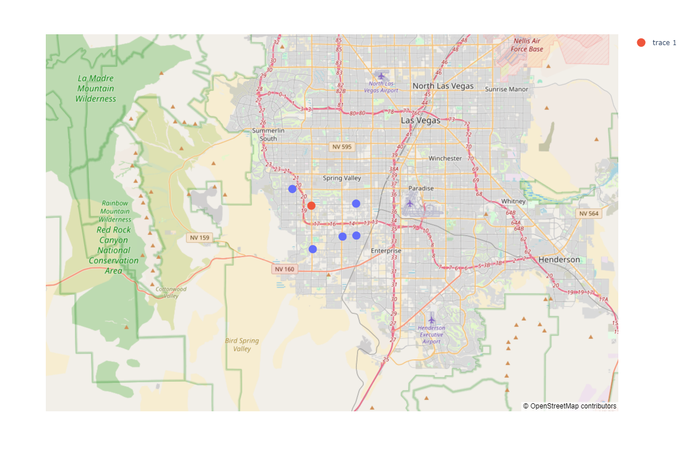

# Location and Review-Based Restaurant Recommendation System

This project is an **End-to-End Restaurant Recommendation System** based on location and review data. The system uses clustering algorithms (KMeans) for location-based and review-based clustering to provide personalized restaurant recommendations. The user interface integrates with Google Maps for a professional experience.

---

## **Table of Contents**
- [Objective](#objective)
- [Dataset Description](#dataset-description)
- [Statistical Analysis](#statistical-analysis)
- [Methodology](#methodology)
- [Results](#results)
- [How to Run](#how-to-run)
- [Future Improvements](#future-improvements)

---

## **Objective**
The system aims to recommend restaurants based on:
1. **User Location**: Clustering nearby restaurants.
2. **Review Quality**: Based on scaled reviews (`stars` and `review_count`).

---

## **Dataset Description**
The dataset used for this project is sourced from Yelp's business dataset and includes the following:
- **Features**: 
  - `name`, `address`, `latitude`, `longitude`, `stars`, `review_count`, `categories`, etc.
- **Target**: Personalized restaurant recommendation.

---

## **Statistical Analysis**
### Key Observation (Numerical Data):

1. Location Data( Latitude , Longitude):
    - The business span a wide geographical area.
    - Latitude ranges between 33.20 and 51.30, while longitude ranges between -115.49 and -72.91, indicating coverage across North america.

2. Star Ratings (stars):
    - The average rating is 3.59 stars
    - The majority of business are rated between 3 to 4.5 stars
    -  Minimum rating is 1 star and the maximum is 5 stars.

3. Review Count (review_count):
    - The  review count varies significantly with a mean of 33.54 and a maximum of 8,348 reviews.
    - Most business have fewer than 25 reviews (Q3), indicating a skewd distribution with a few popular business driving up the average.

4. Open status (is_open):
    - About 82% of business are open (mean=0.82), while 18% are closed.
    - Binary distribution: 0(closed) and 1(open).


### Key Observation (Categorical Data):

1. Business Names:
    - Starbucks is the most common business name, appearing 1,066 times.

2. City Distribution:
    - Las Vegas has the highest concentration of business (29,370 entries).

3. State Data:
    - The most common state is Arizona (AZ), with 56,686 business.

4. Postal Codes:
    - Postal code 89109 is the most frequently occuring suggesting a business hub in that area.

5. Attributes:
    - About 85% (163,773/192,609) ofbusiness have attributes listed.
    - The most frequent attribute is 'BusinessAcceptsCreditCards: True'.

6. Categories:
    - The top category is "Restaurant, Pizza", appearing 1,042 times.
    - This highlights the dominance of restaurant-related business.

7. Hours:
    - Only 76.7% of business have their hours listed.
    - The most frequent entry shows businesses without set hours (0:0-0:0).


### 1. **Visualization**
#### Density Plot
The following density plot shows the distribution of restaurant locations in Las Vegas:

#### Insights
- High Density Core.
    - DBSCAN might form a single cluster of all the densed packed points.
    - It may fail to identify the subclass
- Points in the low densed packes will be identified as outlier -1
- DBSCAN may struggle with datasets that have both high-density and low-density areas because it uses a single global eps value for all regions.


### 2. **Location-Based Clustering**
- **Algorithm**: KMeans
- **Features Used**: `latitude` and `longitude`.
- **Result**: Optimal number of clusters determined using Elbow Method.


---

### 3. **Review-Based Clustering**
- **Algorithm**: KMeans
- **Features Used**: Standard scaled `review_count` and `stars`.
- **Result**: Optimal clusters determined using Silhouette Scores.


---

## **Methodology**
1. **Data Transformation**: Standard Scaling of `review_count`.
2. **Clustering**:
   - Location Clusters: Using geographical coordinates.
   - Review Clusters: Combining `review_count` and `stars`.
3. **Recommendation**:
   - Based on user's location, desired `stars`, and minimum reviews.
   - Integrated visualization using Folium Maps.

---

## **Results**
### 1. **Top Recommended Restaurants**
The system provides a personalized recommendation list. Example:


Here is the result for user 1


Here is the result for user 2


Here is the result for user 3

---

### 2. **Interactive Map**
The system generates an interactive map with:
- User's location (blue marker).
- Recommended restaurants (green markers).
- Now This final segment of the model contains both location based and review based recommending system.


---

## **How to Run**
1. Clone this repository:
   ```bash
   git clone https://github.com/your-repo-name.git

2. Install the required dependencies:
   ```bash
   pip install -r requirements.txt

3. Run the Flask application:
   ```bash
   python app.py

You can enter your location, star preferences, and review count to get top restaurant recommendations with an interactive map.

## Contribution
Contributions are welcome! Please feel free to submit a Pull Request.

